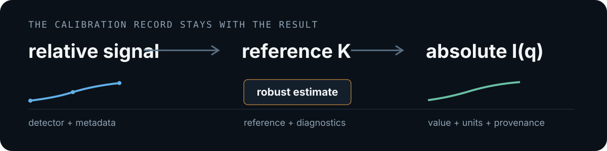
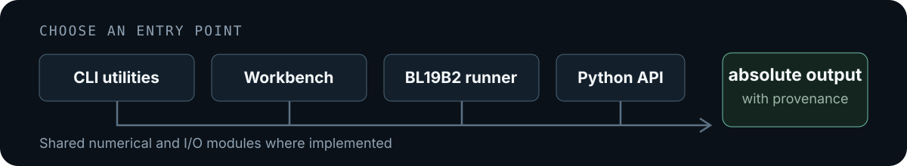
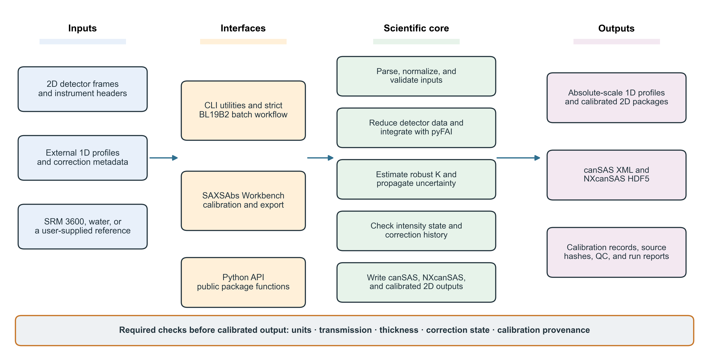
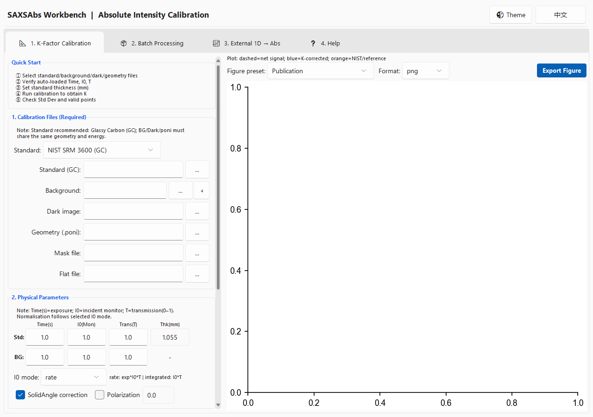
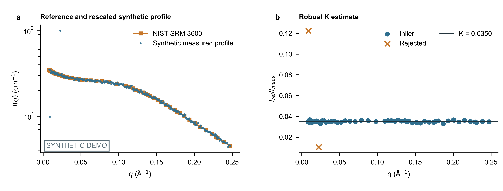

# SASAbs

<p align="center">
  <strong>Traceable absolute-intensity calibration for small-angle X-ray scattering.</strong><br>
  Python API · command-line workflows · bilingual desktop workbench
</p>

<p align="center">
  <a href="https://github.com/D-sudoasd/SASAbs/actions/workflows/ci.yml"></a>
  <a href="https://doi.org/10.5281/zenodo.19687103"></a>
  <a href="LICENSE"></a>
  
</p>

<p align="center">
  
</p>

`saxsabs` combines robust K-factor estimation, explicit intensity states,
reusable data writers, and provenance checks. The result and the processing
record remain reviewable together.

Reviewers should use the unreleased 2.0.0 tree on
[`main`](https://github.com/D-sudoasd/SASAbs). GitHub Release
[v1.1.1](https://github.com/D-sudoasd/SASAbs/releases/tag/v1.1.1) is an earlier
archive and is not this candidate. Do not treat the Zenodo concept DOI as a
version DOI for 2.0.0.

<p align="center">
  <a href="#quick-start"><strong>Quick start</strong></a> ·
  <a href="#choose-a-workflow">Choose a workflow</a> ·
  <a href="docs/api.md">API reference</a> ·
  <a href="docs/architecture.md">Architecture</a> ·
  <a href="SUBMISSION_READINESS.md">Submission readiness</a> ·
  <a href="#citation">Citation</a>
</p>

## Quick start

Install from the repository and verify the headless CLI:

```bash
git clone https://github.com/D-sudoasd/SASAbs.git
cd SASAbs
python -m pip install -e .

saxsabs norm-factor --mode rate --exp 1.0 --mon 100000 --trans 0.8
# 80000.0
```

Launch the desktop application:

```bash
python -m pip install -e ".[gui]"
saxsabs-workbench --lang en
```

The core package requires Python 3.10+, NumPy, pandas, and xraydb. The project
does not currently document a PyPI installation.

<details>
<summary><strong>Optional dependency groups</strong></summary>

```bash
python -m pip install -e ".[hdf5]"     # NXcanSAS HDF5
python -m pip install -e ".[io]"       # FabIO detector-image I/O
python -m pip install -e ".[bl19b2]"   # strict BL19B2 workflow
python -m pip install -e ".[dev]"      # tests and Ruff
```

The Workbench uses Tk. Windows and macOS Python installers commonly include it.
On Linux, install the distribution's Tk package (often `python3-tk`) if
`python -m tkinter` cannot open a test window. API and CLI workflows do not need
a display server.

</details>

## Choose a workflow

<p align="center">
  
</p>

| Route | Best for | Start here |
| --- | --- | --- |
| **CLI utilities** | normalization, header and 1D parsing, gated K estimation, gated buffer subtraction | `saxsabs --help` |
| **SAXSAbs Workbench** | interactive K calibration, batch processing, external-1D scaling | `saxsabs-workbench --lang en` |
| **Strict BL19B2 runner** | validated campaign inputs under current BL19B2 conventions | [batch runbook](docs/bl19b2_abs2d_batch_runbook.md) |
| **Python API** | reusable scientific calculations and file I/O | [API reference](docs/api.md) |

The routes share numerical and I/O modules where implemented, but the Workbench
is not presented as equivalent to the stricter BL19B2 campaign runner.

## What the software records

- reference-derived calibration using NIST SRM 3600, water, or a supplied profile;
- explicit `raw_counts`, `relative`, `absolute_cm^-1`, and `ambiguous` states;
- transmission, thickness, monitor semantics, units, and applied corrections;
- partial uncertainty status without silently substituting zero for unknown terms;
- source identity where available, calibration context, and processing metadata;
- CSV/TSV, canSAS1d XML, and optional NXcanSAS HDF5 outputs.

<details>
<summary><strong>Open the detailed architecture diagram</strong></summary>

<p align="center">
  
</p>

</details>

## Workbench

<p align="center">
  
</p>

The desktop interface exposes K-factor calibration, 2D batch processing,
external-1D scaling, and built-in help. The image above was captured from the
English interface in the current source tree; it is interface documentation,
not experimental evidence.

## Reproducible example

The bundled example generates deterministic synthetic dark, background,
standard, and sample frames, then runs the package reduction APIs:

```bash
python examples/minimal_2d/run_minimal_2d_pipeline.py
```

It writes inspectable CSV, TSV, and XML outputs, plus HDF5 when `h5py` is
installed. The script gates the standard profile as `relative` before $K$,
writes `absolute_cm^-1` metadata, and checks that the XML exposes `i_abs`
rather than `i_rel`. The acceptance summary requires `k_relative_error < 0.005`
and `sample_max_relative_error < 0.01`. See the
[example documentation](examples/minimal_2d/README.md) for construction details
and expected files.

<p align="center">
  
</p>

> This example recovers a planted synthetic $K$ and sample curve and checks
> labeled file content. It is not measured-beamline validation or independent
> third-party format validation.

## Documentation

- [API reference](docs/api.md) — public functions, inputs, outputs, and boundaries
- [Architecture](docs/architecture.md) — module responsibilities and interface limits
- [BL19B2 runbook](docs/bl19b2_abs2d_batch_runbook.md) — strict 2D campaign path
- [Manual verification](examples/manual-verification.md) — GUI and workflow checks
- [Reviewer FAQ](docs/reviewer-faq.md) — evidence, scope, and known limitations
- [Submission readiness](SUBMISSION_READINESS.md) — verified checks and remaining gates
- [Author confirmation form](docs/author-confirmation-form.md) — author-controlled facts required before submission
- [Changelog](CHANGELOG.md) — version history

## Scope and limitations

Absolute calibration depends on a suitable reference, detector geometry,
monitor semantics, transmission, thickness, and instrument-specific provenance.
The strict 2D workflow currently targets BL19B2 conventions. canSAS1d and
NXcanSAS layouts are covered by project-local round-trip tests. An offline
check on 15 August 2026 validated the deterministic example against the official
canSAS1d 1.1 XSD and punx 0.3.5 with its bundled v2018.5 definitions; that check
is not in CI. Current NeXus definitions and third-party consumers have not been
verified.

## Development

The [continuous-integration workflow](https://github.com/D-sudoasd/SASAbs/actions/workflows/ci.yml)
tests the configured Python and operating-system matrix.

```bash
python -m pip install -e ".[dev,gui,bl19b2,hdf5]"
pytest -q
ruff check SASAbs.py saxs_mpl_style.py src tests paper/*.py scripts/*.py
```

Before submission, run the fail-closed local decision gate with Pandoc available:

```bash
python scripts/check_submission_readiness.py \
  --as-of YYYY-MM-DD \
  --manual-confirmations path/to/submission-confirmations.json
```

Run the strict command from the exact branch and commit that will be submitted.
PR #1 is already on `main`. A PASS recorded on an earlier revision does not
cover a later commit; update `submitted_branch` and `submitted_commit` and rerun
the gate on the revision sent to JOSS.

After the strict local gate passes, verify the same commit, branch, visible
README and paper, repository identity, and successful CI run against GitHub:

```bash
python scripts/check_public_candidate.py \
  --confirmations path/to/submission-confirmations.json
```

When the paper remains outside the default branch, the command prints the exact
`@editorialbot set branch-where-paper-is ...` instruction required in the JOSS
pre-review issue. Remote mismatches or unavailable evidence fail closed.

Until the author-controlled fields are complete, use
`--allow-author-placeholders --as-of 2026-08-26` only for mechanical preflight.
That override is not submission authorization. Start from the
[confirmation JSON template](docs/submission-confirmations.example.json) only
after completing the author confirmation form.

Please use the [issue tracker](https://github.com/D-sudoasd/SASAbs/issues) for
reproducible problems and read [CONTRIBUTING.md](CONTRIBUTING.md) before opening
a pull request. Project participation follows the
[Code of Conduct](CODE_OF_CONDUCT.md).

## Citation

For the project as a whole, use the Zenodo concept DOI:

> Gong, D. *SASAbs*. https://doi.org/10.5281/zenodo.19687103

Use a release-specific DOI only for the archived release it identifies.
Machine-readable metadata are available in [CITATION.cff](CITATION.cff).

## License

SASAbs is distributed under the [BSD-3-Clause license](LICENSE).
